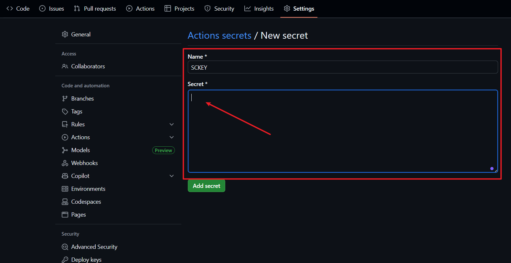

# 🔥 CVE Push Service | 自动化高危漏洞情报推送

  </a>
  </a>
  

> ⚡ 面向网络安全从业者的 **高危漏洞实时情报推送工具**  
> 自动拉取 NVD 最新漏洞数据，筛选 **CVSS ≥ 7.0** 的高危漏洞，并通过 **[Server酱3](https://sc3.ft07.com/)** 第一时间推送到您的设备，帮助您在应急响应等场合中抢占先机。  

---

## 🚀 功能亮点

- ✅ **实时监控**：自动获取 [NVD](https://nvd.nist.gov/) 最新漏洞情报  
- ✅ **高危筛选**：仅推送 **CVSS ≥ 7.0** 的高风险漏洞  
- ✅ **智能翻译**：集成有道翻译 API，支持漏洞描述中文化  
- ✅ **去重存储**：数据库文件增量更新，避免重复推送  
- ✅ **日志管理**：支持日志文件轮转，方便审计与追溯  
- ✅ **自动化运行**：支持 GitHub Actions 定时任务，方便省心，0 运维成本

---

## 🛠️ 使用方法

### 1. 准备工作

- Fork 本项目，Fork 后你的账号下会存在一个同样的项目（接下来的操作将在你自己的项目中进行）

- 直接从手机应用商店搜索`Server酱`下载安装，或访问 [Server酱3](https://sc3.ft07.com/) 点击APP下载。
- 下载app后注册账号，登录官网 [Server酱3](https://sc3.ft07.com/) 微信扫码后即可获取`SendKey`

### 2. 配置 SendKey

本仓库已内置 GitHub Actions 工作流（[AutoCVE.yml](./workflows/AutoCVE.yml) ）。
你只需在仓库 Settings → Secrets 中配置以下变量：
- SCKEY : 你刚注册的 Server酱3 SendKey（注意！前后不要有空格回车）

### 3. GitHub Actions 自动化运行

- 点击 `Actions` 进入运行页面，点击 `I understand my workflow` 按钮。
- 自动刷新后左侧出现 `lalalala` 流程。
- 点击 `lalalala` 流程，点击 `Enable Workflow` 按钮。
- 给自己的项目点击两次 `Star` （Fork后你自己的项目）启动Action。
- 再点击上面的 `Actions` 选择 `lalalala` 流程 -> build -> Monitor CVE 就能看到每次的运行日志,看看有没有报错。
- 没有报错的话Server酱里应该就会有推送通知了（记得打开Server酱App通知权限）
- 推推送效果示例：

### 注意

- 默认是每天早上**8点**（北京时间）开始自动检测**24小时**内是否有新的高危漏洞曝出，如果你想修改，可以在AutoCVE.yml中修改。

---

⚡ 如果本项目对你有帮助，请点一个 ⭐ Star 支持作者！
 

---

## 📅 更新日志

> 目前仅为示例，后续持续完善

- 2025-09-01 ......
- 2025-08-30 🎉 首次发布：支持高危漏洞自动推送，集成 GitHub Actions

> TODO:
- 增加漏洞分类标签与统计报表
- 针对已曝出漏洞实时跟踪全网POC/EXP情况

---

## 💡 致谢

- 感谢 [Server酱3](https://sc3.ft07.com/) 提供稳定的消息推送服务。
- 感谢 [NVD](https://nvd.nist.gov/) 提供权威的漏洞情报源。
- 翻译由 **有道开放平台** 提供。
